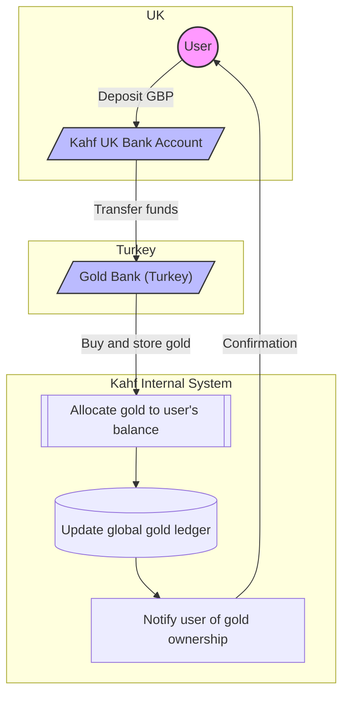
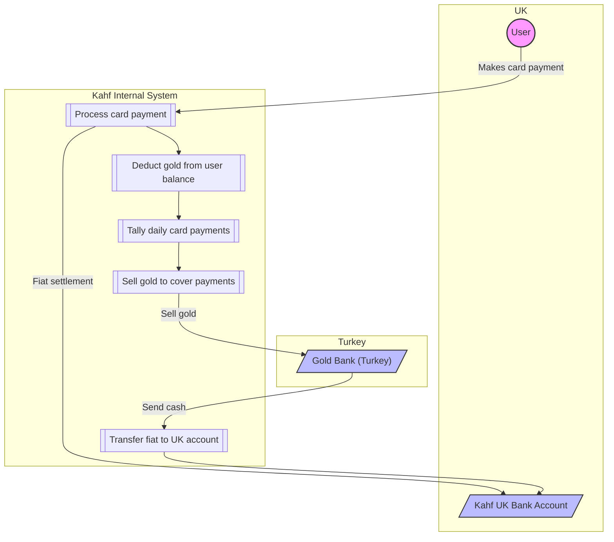

# 💳 Kahf Gold-Backed Card System

This project outlines the flows used in Kahf’s gold-backed debit card system.

---

## 🪙 Flow 1: User Deposits Money and Acquires Gold

```mermaid
flowchart TD
    subgraph UK [UK]
        user((User)):::actor
        ukAccount[/"Kahf UK Bank Account"/]:::bank
    end

    subgraph Turkey [Turkey]
        goldBank[/"Gold Bank (Turkey)"/]:::bank
    end

    subgraph KahfSystem [Kahf Internal System]
        allocation[[Allocate gold to user's balance]]
        ledger[(Update global gold ledger)]
        notify[Notify user of gold ownership]
    end

    user -->|Deposit GBP| ukAccount
    ukAccount -->|Transfer funds| goldBank
    goldBank -->|Buy and store gold| allocation
    allocation --> ledger
    ledger --> notify
    notify -->|Confirmation| user

    classDef actor fill:#f9f,stroke:#333,stroke-width:2px;
    classDef bank fill:#bbf,stroke:#333,stroke-width:1.5px;
```

```mermaid

flowchart TD
    subgraph UK [UK]
        user((User)):::actor
        ukAccount[/"Kahf UK Bank Account"/]:::bank
    end

    subgraph Turkey [Turkey]
        goldBank[/"Gold Bank (Turkey)"/]:::bank
    end

    subgraph KahfSystem [Kahf Internal System]
        payment[[Process card payment]]
        deduct[[Deduct gold from user balance]]
        tally[[Tally daily card payments]]
        sell[[Sell gold to cover payments]]
        transferBack[[Transfer fiat to UK account]]
    end

    user -->|Makes card payment| payment
    payment -->|Fiat settlement| ukAccount
    payment --> deduct
    deduct --> tally
    tally --> sell
    sell -->|Sell gold| goldBank
    goldBank -->|Send cash| transferBack
    transferBack --> ukAccount

    classDef actor fill:#f9f,stroke:#333,stroke-width:2px;
    classDef bank fill:#bbf,stroke:#333,stroke-width:1.5px;

```

