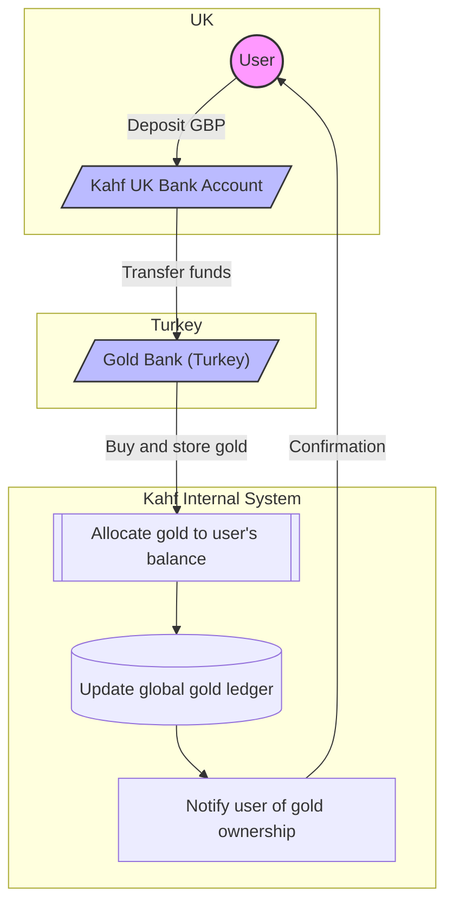

# 💳 Kahf Gold-Backed Card System

This project outlines the flows used in Kahf’s gold-backed debit card system.

---

## 🪙 Flow 1: User Deposits Money and Acquires Gold




```mermaid

graph TD
    %% Define the entities/actors
    subgraph Entities
        A[User]
        B[External Card Partner]
        C[Kahf]
        D[Global Gold Ledger]
        E[Turkey's Gold Bank]
        F[Receiving Merchant]
    end

    %% Flow 2: User Makes a Payment Using Their Debit Card
    subgraph Flow 2: User Makes a Payment
        1[User Makes Payment via Card] --> |1. Debit Card Transaction| 2{External Card Partner Authorizes & Settles}
        2 --> |1a. Cash Paid from Card Partner's Pool| F
        2 --> |2. Real-time API Notification of Payment| C
        C --> |2a. Calculate Gold Equivalent & Update User's Gold Balance| D
        D --> |2b. User's Gold Balance Reduced| C

        subgraph Overnight Reconciliation & Replenishment
            style 3 fill:#f9f,stroke:#333,stroke-width:2px
            style 4 fill:#f9f,stroke:#333,stroke-width:2px
            style 5 fill:#f9f,stroke:#333,stroke-width:2px
            style 6 fill:#f9f,stroke:#333,stroke-width:2px

            3[Overnight: Card Partner Tallies All Payments] --> |3a. Reconciliation Report| C
            C --> |4. Instruct Gold Bank to Liquidate Gold (from Kahf's overall balance)| E
            E --> |4a. Cash Out Gold (e.g., to USD/GBP)| C

            5[Liquidated Cash Sent to Card Partner's Liquidity Account] --> |5a. Replenish Card Partner's Cash Pool| B
            B --> |5b. Ready for Future Payments| 1

        end
    end

    %% Link the subgraphs for clarity (optional, but good for visual flow)
    C -- "Manages" --> D
    E -- "Holds & Liquidates Gold" --> C
    B -- "Issues Card & Manages Cash" --> A

```
