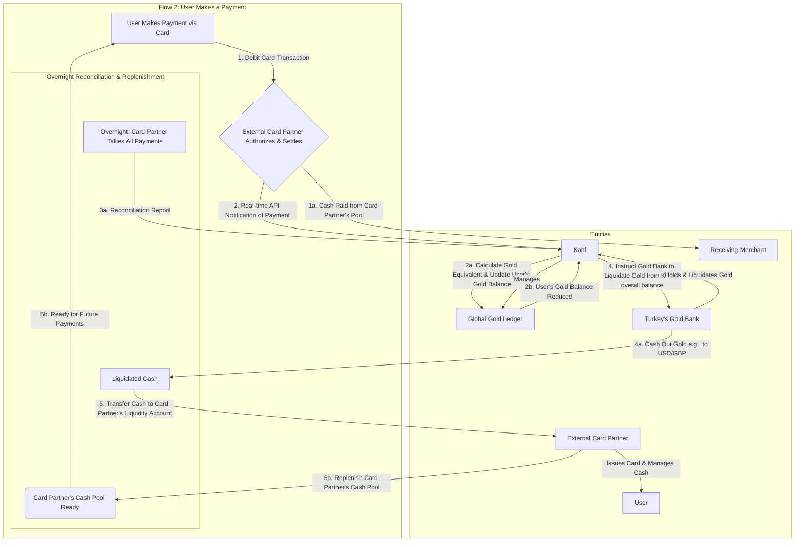

# 💳 Kahf Gold-Backed Card System

This project outlines the flows used in Kahf’s gold-backed debit card system.

---

## 🪙 Flow 1: User Deposits Money and Acquires Gold

## Flow 2: User performs a card transaction

